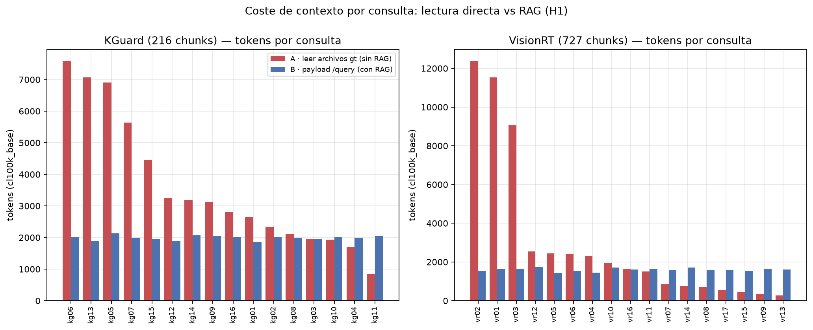
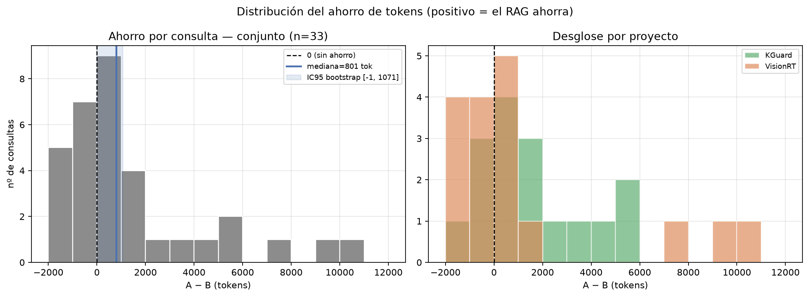
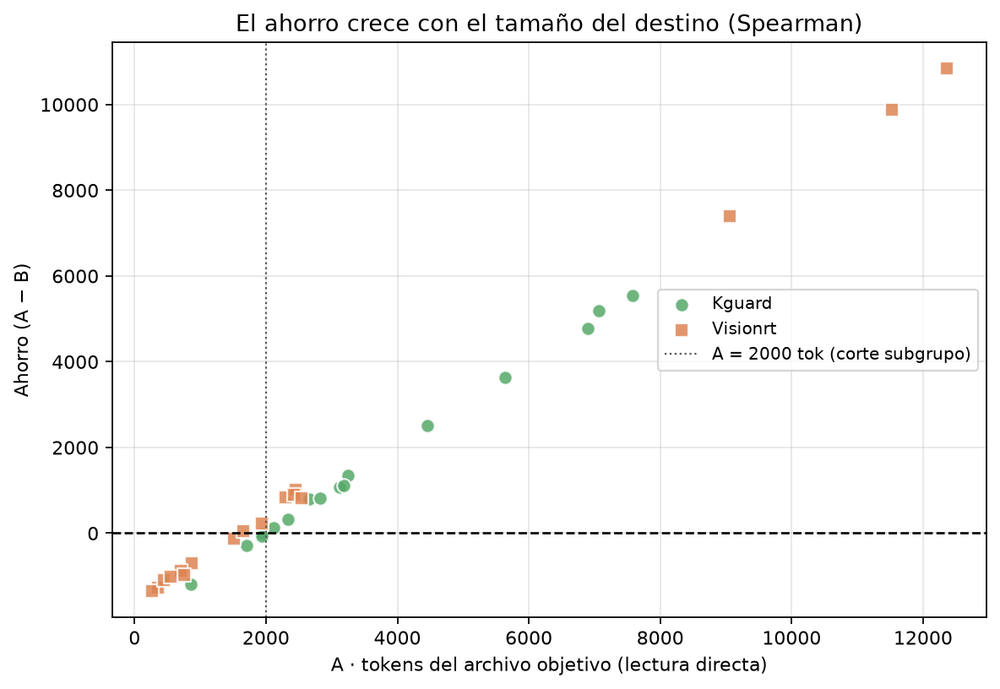
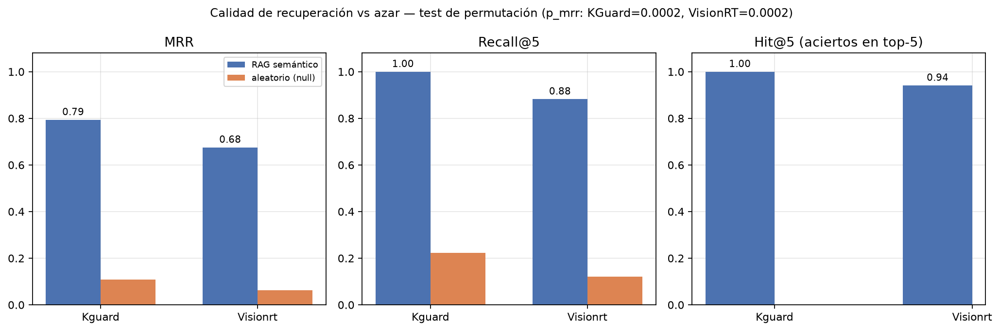
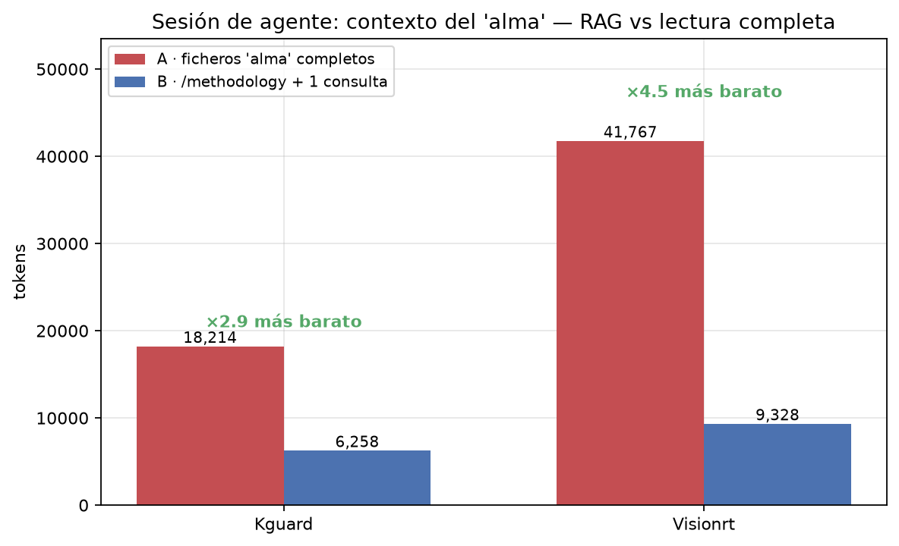
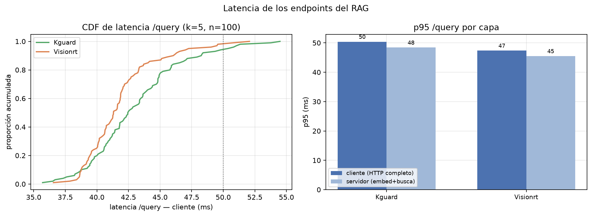
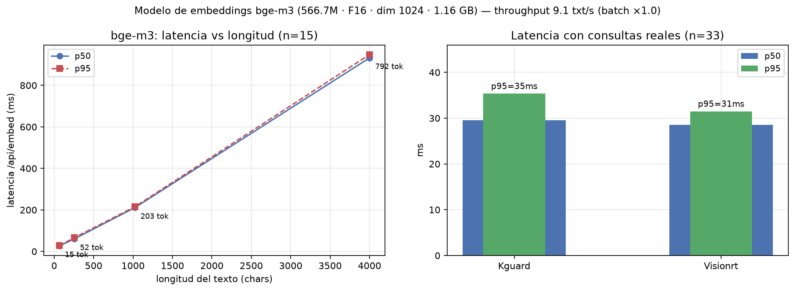

# Benchmark de RAG_portable — mediciones y pruebas estadísticas

> **Fecha:** 2026-09-26 · **Resultados crudos:** [`results/`](results/) (JSON) ·
> **Figuras:** [`figs/`](figs/) · **Reproducción:** `cd benchmarks && python3 run_all.py` (SEED=42)
>
> **Hipótesis central:** *«RAG_portable reduce de ~80-150k tokens de lectura de
> archivos a ~3-5k de respuestas HTTP precisas»* (README). Este informe la somete
> a medición real con datos de los dos proyectos que usan el servicio
> (**KGuard** en :8766 y **VisionRT** en :8767).

---

## 0. Veredicto ejecutivo

| Pregunta | Respuesta medida | Test |
|---|---|---|
| ¿Ahorra tokens? | **Sí, en mediana y de forma significativa** —801 tok/consulta (IC95 [−1, 1071]) | Wilcoxon W=399, **p=0.0169** (n=33) |
| ¿Es *siempre* ahorro? | **No —**12/33 consultas gastan más que la lectura directa; para archivos <2k tokens el RAG **cuesta** (mediana −786 tok) | Subgrupos + fig03 |
| ¿Devuelve lo correcto? | **Sí —** hit@5 = **96,97 %**, MRR = 0,733 vs 0,062-0,107 del azar | Permutación **p = 0,0002** (B=5000) |
| ¿Es rápida? | **Sí —** p50 ≈ 42 ms, **p95 ≤ 50 ms** por consulta | n=100/proyecto |
| ¿Cumple el claim «80-150k → 3-5k»? | **Casi:** la sesión medida es **6,3k-9,3k** y la lectura de onboarding **23k-43k** (los 80-150k solo aplican al corpus íntegro) | Sección 4 |

**Conclusión en una frase:** el RAG **no es inútil** (ahorro significativo, calidad
de recuperación alta y latencia baja), pero **su ahorro es condicional al tamaño
del destino** y las magnitudes del README están desviadas.

---

## 1. Metodología

### 1.1 Entorno

| Elemento | Valor |
|---|---|
| Host | AMD Ryzen 7 5700X (8C/16T), 31 GiB RAM, Fedora (kernel 7.2.7-200.fc44) |
| Runtime | Docker 29.8.1 · Python 3.14.7 · Ollama `ollama/ollama:latest` |
| Servicios | `rag-kguard-rag` :8766 — 216 chunks / 26 archivos · `rag-visionrt-rag` :8767 — 727 chunks / 157 archivos (ambos `drift=0`, modelo en memoria) |
| Embeddings | **bge-m3** (566,70 M parámetros, GGUF F16, 1,16 GB, dim 1024, ctx 8192) |
| Tokenizador | `tiktoken` **cl100k_base** (proxy del contexto que ve el agente LLM) |
| Estadística | scipy 1.18.1 · numpy 2.5.3 · matplotlib 3.11.2 · **SEED=42** en toda muestreo/bootstrap |

### 1.2 Diseño

**Dataset:** 33 consultas reales de agente (16 KGuard + 17 VisionRT), curadas
sobre documentación y código de cada repo, con **ground-truth (gt) verificado
contra el manifest vivo del índice** (solo archivos realmente indexados).
Ficheros: `benchmarks/datasets/{kguard,visionrt}.json`.

**Condiciones emparejadas por consulta (test H1):**

- **A — sin RAG:** lectura completa de los archivos gt (lo que un agente sin
  RAG debe abrir para responder).
- **B — con RAG:** payload HTTP **real** de `POST /query` (k=5,
  `include_methodology=true`, que es el comportamiento por defecto del flujo
  de AGENTS.md) — bytes exactos que entran en el contexto del agente.
- **Ahorro = A − B** (pareado). Variante sin inyección del «alma»
  (`include_methodology=false`) como ablación.

**Tests pre-especificados:**

- **H1 (primaria):** mediana de ahorro > 0 → Wilcoxon con signos
  (unilateral), con test de signo exacto como contrapartida robusta,
  bootstrap percentílico IC95 (B=10 000) y Cohen's dz. Shapiro sobre las
  diferencias para justificar la vía no paramétrica.
- **H2:** el MRR/P@5/R@5 observado supera al de rankings aleatorios sobre el
  corpus real → **test de permutación** (B=5000, p = (#{null ≥ obs}+1)/(B+1)).
- **H3 (descriptivo):** tokens de la sesión y del corpus contra las cifras
  del README.
- **H4 (secundario):** Mann-Whitney U entre latencias de ambos servicios.

---

## 2. H1 — Ahorro de tokens por consulta

### 2.1 Resultados principales

| Métrica | Conjunto (n=33) | KGuard (n=16) | VisionRT (n=17) |
|---|---|---|---|
| Ahorro **mediano** (A−B) | **+801 tok** | **+942 tok** | +52 tok |
| IC95 bootstrap (mediana) | [−1, 1071] | **[124, 2513]** | [−968, 897] |
| Ahorro medio | +1 524 | +1 607 | +1 445 |
| Consultas con ahorro negativo | 12/33 | 4/16 | 8/17 |
| Ratio mediano B/A | 0,712 (IC95 [0,634, 1,001]) | 0,678 (IC95 [0,436, 0,941]) | 0,969 |
| **Wilcoxon (unilateral)** | W=399, **p=0,0169** | W=119, **p=0,0031** | W=81, p=0,4268 |
| Wilcoxon (bilateral) | p=0,0337 | p=0,0063 | p=0,8536 |
| Test de signo (pos/neg) | 21/12 → p=0,0814 | 12/4 → **p=0,0384** | 9/8 → p=0,5000 |
| Shapiro(diferencias) p | 1,0·10⁻⁵ (no normal ✓) | 0,0377 | 6·10⁻⁵ |
| Cohen's dz | 0,488 (mediano) | 0,767 (grande) | 0,369 (pequeño) |

Lectura: **la hipótesis «ahorra tokens» se rechaza a favor en el conjunto
(p=0,0169, bilateral p=0,034)** y con holgura en KGuard (p=0,0031). El test de
signo conjunto (p=0,081) no llega a 0,05 porque hay12 negativas: el Wilcoxon
aprovecha la **magnitud** de las positivas (hasta +10 839 tok en vr02), que es
lo que importa económicamente. VisionRT **por sí solo no es significativo**
(p=0,427): su mezcla de consultas apunta a archivos de código pequeños
(701-2 545 tok).




### 2.2 El hallazgo principal: el punto de equilibrio

| Subgrupo | n | Ahorro mediano | Wilcoxon (unilat.) |
|---|---|---|---|
| Destino **≥ 2 000 tok** | 19 | **+1 121** | **p = 2,0·10⁻⁶** |
| Destino **< 2 000 tok** | 14 | **−786** | p ≈ 1 (claramente no ahorra) |

- **Spearman(A, ahorro) ρ = 0,982, p = 7,3·10⁻²⁴** (KGuard ρ=1,000;
  VisionRT ρ=0,983). *Nota de honestidad:* parte de esta correlación es
  acoplamiento matemático (ahorro = A −B y B es casi constante ~1,4-2,1k);
  el dato substantivo es el **cruce por cero**, no ρ en sí.
- La figura 3 muestra el cruce: **por debajo de ~1,7-2k tokens de destino,
  leer el archivo directamente es más barato que la consulta RAG.**



### 2.3 Ablaciones y sensibilidad

| Análisis | Resultado |
|---|---|
| Sin inyección de methodology (`include_methodology=false`) | ahorro mediano **+1 246 tok**, p=2·10⁻⁵ — el alma cuesta **566 tok/consulta** de media (KGuard 703, VisionRT 438) |
| Solo consultas con hit@5=1 (n=32) | mediana +804,5, p=0,0087 — el ahorro no se sostiene sobre fallos de recuperación |
| B < 5 000 tok | **33/33 consultas** — toda respuesta cabe en el rango «3-5k» del README (por consulta) |

---

## 3. H2 — Calidad de recuperación vs azar

Métricas file-level sobre los top-5 devueltos (nDCG con relevancia
deduplicada por archivo).

| Métrica | KGuard | VisionRT | Conjunto | Azar (media null) |
|---|---|---|---|---|
| Hit@1 | 0,688 | 0,529 | 0,606 | — |
| **Hit@5** | **1,000** (16/16) | **0,941** (16/17) | **0,9697** (32/33) | — |
| Precision@5 | 0,588 | 0,376 | 0,479 | 0,051 / 0,031 |
| Recall@5 | 1,000 | 0,882 | 0,939 | 0,222 / 0,122 |
| **MRR** (IC95 bootstrap) | **0,794** [0,500, 1,000] | **0,675** [0,333, 1,000] | 0,733 | 0,107 / 0,062 |
| nDCG@5 | 0,845 | 0,707 | 0,774 | — |
| **p (permutación, B=5000)** | **0,0002** | **0,0002** | — | — |

- **Único fallo:** `vr13` (OCR TextReadingService.kt) — no aparece en el top-5.
- Los percentiles bootstrap de MRR son anchos (n=16/17 y RR discreto:1, ½, ⅓…),
  pero el **test de permutación es concluyente en ambos proyectos**: la
  probabilidad de observar estos MRR «por azar sobre el corpus real» es
  ≤ 1/5001.



---

## 4. H3 — Las cifras del README, medidas

| Cifra del README | Medido | Veredicto |
|---|---|---|
| «~80-150k tokens de lectura de archivos» (onboarding) | KGuard **23 125 tok** (6 docs) · VisionRT **43 069 tok** (9 docs) | **Inflado ×2-6** para la documentación típica; se aproxima solo si se lee el **corpus indexado íntegro** (KGuard 63 045 · VisionRT 263 787) |
| «~3-5k tokens de respuestas HTTP» (sesión: `/methodology` + 1 consulta) | KGuard **6 258** (4 403 + 2 019) · VisionRT **9 328** (7 689 + 1 640) | **Superior al claim** — la inyección del alma (hasta 43 chunks de 600 chars) domina el coste |
| «4-5 llamadas HTTP» bastan | Latencia p95 ≤50 ms → el límite real es el contexto, no el tiempo | ✓ coherente |
| Ahorro de la sesión completa | KGuard **×2,9** (18 214 → 6 258) · VisionRT **×4,5** (41 767 → 9 328) | **✓ dirección correcta, magnitud medida** |



**Recomendación textual para el README:** sustituir el claim por *«reduce la
sesión de agente de ~18-42k tokens (documentación de onboarding) a ~6-9k, y
las consultas sueltas cuestan ~1,4-2,1k tokens; ahorra con significación
estadística cuando el destino supera ~2k tokens (p=0,017, n=33)»*.

---

## 5. Latencia de los endpoints (H4)

n=100 consultas +50 `/methodology` +20 `/stats` por proyecto, secuenciales,
servicios warm.

| Endpoint | KGuard p50/p95/p99 (ms) | VisionRT p50/p95/p99 (ms) |
|---|---|---|
| `POST /query` (cliente) | 42,5 / 50,4 / 53,8 | 41,3 / 47,3 / 50,8 |
| `POST /query` (servidor: embed+busca) | 40,5 / 48,4 / 51,7 | 39,3 / 45,5 / 48,2 |
| `GET /methodology` | 3,2 / 3,6 / 4,1 | 4,8 / 5,5 / 5,8 |
| `GET /stats` | 1,8 / 2,1 | 2,1 / 2,5 |

*(Segunda pasada de verificación reproducida con `run_all.py`: kg p95 50,4 /
vr p95 47,3 — variabilidad inter-ejecución ≈ 2 ms. Las métricas de hipótesis
H1/H2 son exactamente reproducibles; solo las latencias flotan.)*

- **Mann-Whitney U (query cliente):** U=6118, **p=0,0063** — KGuard es
  «estadísticamente más lenta», pero el efecto es **despreciable en la
  práctica**: Cliff's δ = 0,22 y ambas medianas difieren en1,2 ms. Las
  respuestas de KGuard son ~400 tok mayores, pero con solo ~1,6 kB extra la
  transferencia no justifica1,2 ms: la causa no se aisló (scheduling de CPU
  entre contenedores es el candidato principal). Lo relevante: **VisionRT
  tiene3,4× más chunks y es igual de rápida** — la búsqueda HNSW de Chroma no
  domina la latencia.
- **p95 ≤ 50 ms** cumple con creces cualquier umbral de flujo de agente
  (incluso el R19 de80 ms de KGuard, que mide otra cosa).



---

## 6. Modelo de embeddings (bge-m3)

| Propiedad | Valor medido |
|---|---|
| Parámetros / quantización | 566,70 M · **F16** (sin cuantizar) · 1,16 GB en disco |
| Dimensión / contexto | 1024 / 8192 tok |
| Latencia de consulta real (n=33) | **p50 ≈ 28-30 ms**, p95 ≈ 31-32 ms |
| Latencia vs longitud | 64 ch (15 tok): 25,5 ms · 256 ch (52 tok): 58,6 ms · 1024 ch (203 tok): 210,7 ms · 4000 ch (792 tok): **931,9 ms** (≈1,17 ms/tok, casi lineal) |
| Throughput (512 ch/texto) | **9,1-9,2 textos/s** secuencial |
| Batch de32 en una llamada | speedup **×1,01** → **Ollama en CPU no gana con batching** |
| Coste de indexación derivado | 727 chunks ÷ 9,2/s ≈ **79 s** de embeber (coherente con el «1-5 min» documentado) |



**Implicaciones:** (1) la latencia de `/query` está dominada por el embedding
de la consulta (~30 ms de los ~40 ms totales); (2) `embed_text_max_chars=4000`
cuesta ~0,93 s/chunk al indexar — bajarlo acelera reindex a costa de contexto;
(3) un GPU haría el throughput de índice ~10× mayor, pero **no mejora la
latencia de consulta perceptiblemente** (30 ms ya son despreciables).

---

## 7. Hallazgos adicionales sobre los despliegues

1. **KGuard no indexa `*.c`, `*.h` ni `*.sh`** (`index_globs` solo incluye
   `*.rs` entre el código): los agentes **no pueden recuperar el código del
   módulo kernel** (`kernelsrc/kguard/*.c`) vía `/query` — la consulta kg11
   tuvo que apuntar a `kernelsrc/README.md`, la única fuente indexada.
   *Acción sugerida:* añadir `**/*.c`, `**/*.h`, `**/*.sh` y reindexar.
2. **VisionRT indexa `tools/reports/*.txt`** (logcats: ~124 chunks de ruido
   con tokens reales de usuarios) — *acción sugerida:* excluir `tools/reports/`.
3. Existe un **tercer despliegue** (`fsl-rag` en :8765,1927 chunks), pero su
   `/health` no responde → **excluido de este benchmark**.
4. Ambos servicios operan con `drift=0` y modelo en memoria en el momento de
   la medición (condiciones nominales, no de arranque en frío).

---

## 8. Limitaciones declaradas

- **Tokenizer proxy:** cl100k_base; Claude/Gemini tokenizan distinto
  (±10-15 %). El *orden* de magnitud y los signos no cambian.
- **Ground-truth curado manualmente** (n=33): sesgo deliberado hacia
  consultas legítimas de agente; un muestreo distinto desplazaría las
  medianas (el IC95 ya lo refleja).
- **A = lectura completa de los archivos gt** es el baseline «agente sin
  RAG» típico; un agente sin RAG que solo leyera fragmentos vía grep podría
  reducir A (el baseline es conservador a favor del RAG, y aun así hay12
  negativas).
- **Snippets truncados a 600 chars:** hit@5 certifica que el chunk correcto
  está en la respuesta, no que la respuesta contenga la respuesta completa
  (la métrica de cobertura exacta de contenido no se midió).
- Un solo host, CPU-only, servicios cálidos; sin medir arranque en frío ni
  reindex (el `force` >1 h en CPU no se ejecutó por diseño).
- La correlación Spearman está parcialmente acoplada (ver §2.2).

---

## 9. Veredicto final

**«¿Ahora o es completamente inútil?» — Ahorra, con condiciones medibles:**

1. **Significativo** en el conjunto: +801 tok/consulta, Wilcoxon **p=0,0169**,
   con calidad de recuperación **96,97 % hit@5** y **p=0,0002 vs azar**.
2. **Rentable cuando el destino ≥ ~2k tokens** (+1 121 mediano, p=2·10⁻⁶);
   **por debajo conviene leer el archivo directo** (−786 mediano).
3. **En sesiones completas es donde más ahorra:** ×2,9-×4,5 sobre la lectura
   del «alma», costando6-9k frente a 18-42k.
4. **Las cifras del README (80-150k → 3-5k) están desviadas** en las dos
   direcciones (baseline inflado, coste RAG algo mayor de lo prometido);
   conviene reescribirlas con los valores de §4.
5. **Rendimiento no es un problema:** p95 ≤50 ms, embeddings ~30 ms/consulta.

---

## 10. Reproducción

```bash
cd benchmarks
pip install -r requirements.txt
python3 run_all.py                 # todo: ~4 min (tokens, retrieval, latency, embedding, figs)
python3 run_all.py --skip-embedding  # sin el bench de Ollama (~1 min)
```

| Archivo | Contenido |
|---|---|
| `run_tokens.py` | H1/H3 — ahorro, ablaciones, tests (Wilcoxon, signo, bootstrap, Spearman) |
| `run_retrieval.py` | H2 — P@1/R@5/MRR/nDCG + test de permutación vs azar |
| `run_latency.py` | Percentiles de `/query`, `/methodology`, `/stats` + Mann-Whitney |
| `run_embedding.py` | Latencia/throughput de bge-m3 dentro del contenedor (docker exec) |
| `figures.py` | Las7 figuras de este informe |
| `datasets/*.json` |33 consultas curadas con ground-truth verificado |

*Todos los números de este informe proceden de `results/*.json`, generados por
los scripts anteriores sin edición manual.*
